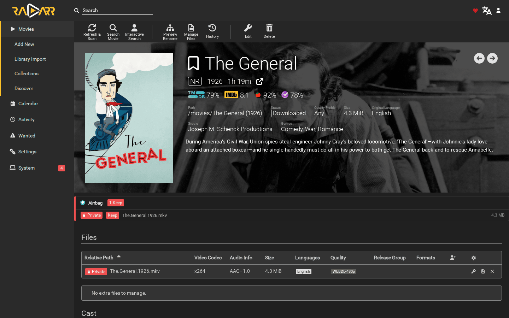
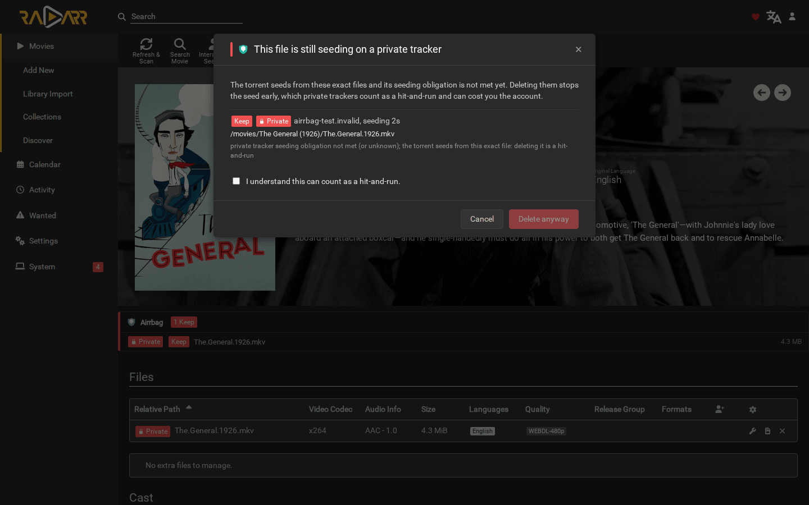
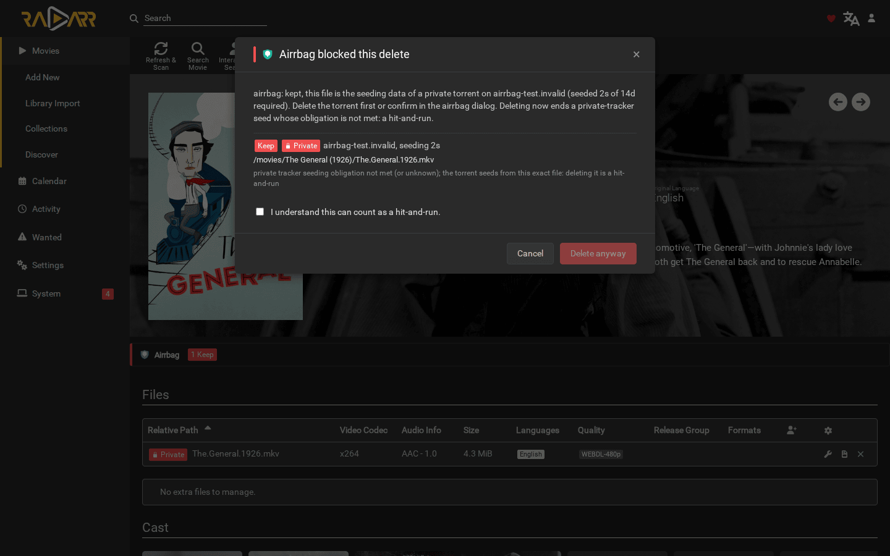
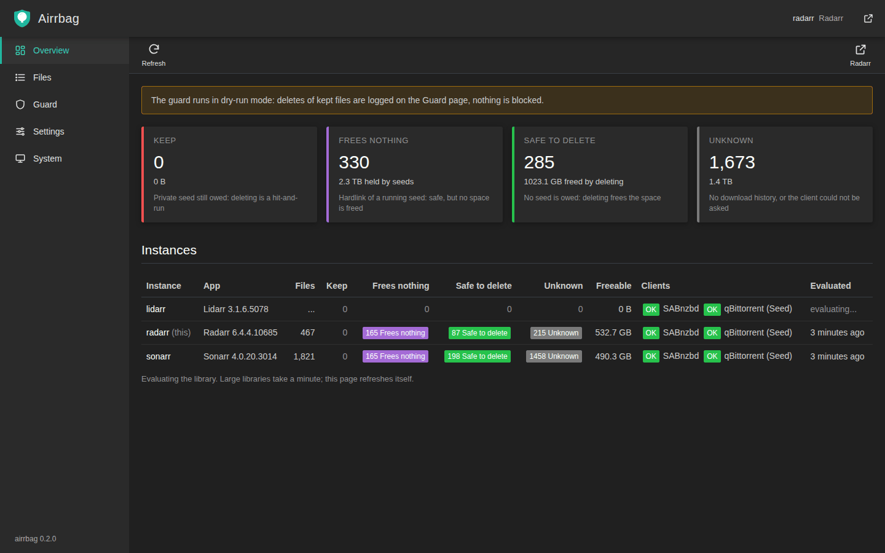
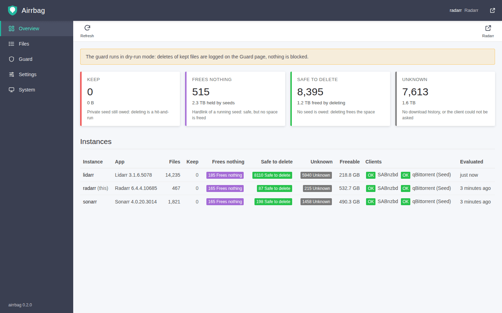
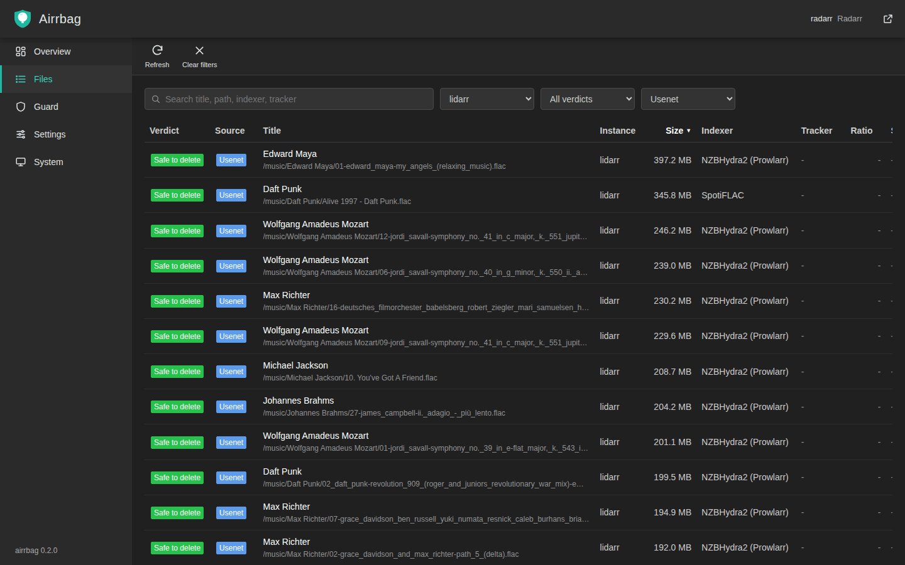
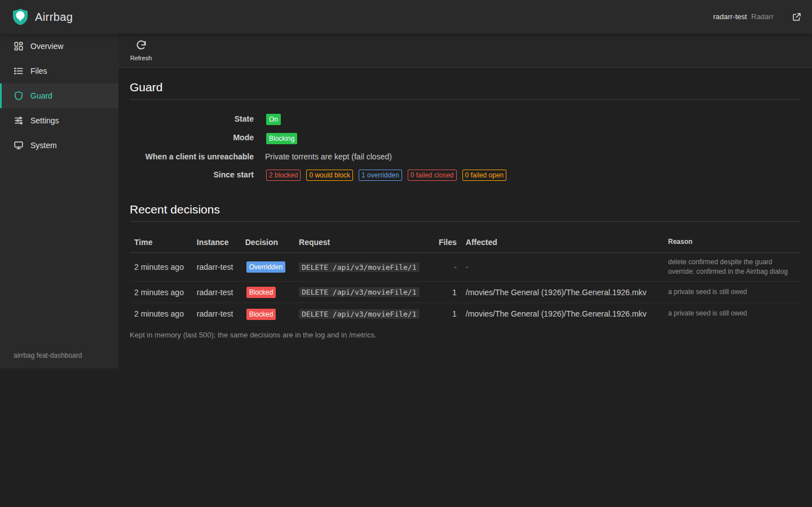

<p align="center"></p>

# airrbag

[](https://github.com/fishingpvalues/airrbag/releases)
[](https://github.com/fishingpvalues/airrbag/actions/workflows/ci.yml)
[](LICENSE)

Know where every file in [Sonarr](https://sonarr.tv), [Radarr](https://radarr.video),
[Lidarr](https://lidarr.audio), Readarr and Whisparr came from, and stop
deletes that would break a private-tracker seed.

airrbag is a reverse proxy in front of the *Arr web UI and API. In the UI it
adds a badge to every file: Usenet, public torrent, or private torrent. On a
delete it checks what the delete would actually do to the seed behind the file,
and refuses the ones that would end a private seed that is still owed.

Deleting a library file is one of three things, and the *Arr cannot tell them
apart:

| The library file is | Deleting it |
|---------------------|-------------|
| a separate copy, or from Usenet | frees the space; nothing seeds from it |
| a hardlink of a file a torrent seeds | is safe for the seed, but frees no space until the torrent goes too |
| the file a private torrent seeds from | ends the seed early: a hit-and-run |

History says where a file came from. Only the filesystem says which of the
three it is, because two names for the same bytes share an inode. airrbag
compares inodes.

## Screenshots

Source badges on a Radarr movie page, and the confirmation that opens before a
delete would end a private seed:





If a delete reaches the server-side guard anyway, its refusal opens the same
dialog with the server's message:



The dashboard, one per process, reachable under every proxied *Arr:









The movie and its private torrent in the first three are a throwaway test
fixture (a generated video registered as The General, 1926, seeded with a
private flag from a test qBittorrent); the dashboard shows a real library.

## Install

```bash
docker run -d \
  -p 127.0.0.1:17878:17878 \
  -e RADARR_API_KEY \
  -e QBITTORRENT_PASSWORD \
  -v ./airrbag.yml:/config/airrbag.yml:ro \
  -v /srv/media:/media:ro \
  ghcr.io/fishingpvalues/airrbag:latest
```

Then open `http://localhost:17878` instead of Radarr's own port. Radarr works
exactly as before; the badges and the delete check sit on top.

The image is a single static binary on distroless, running as a non-root user
with a read-only root filesystem. Mount the media read-only at paths you then
map in the config. See [`examples/docker-compose.yml`](examples/docker-compose.yml)
and [`examples/airrbag.yml`](examples/airrbag.yml).

Binaries for Linux, macOS, FreeBSD and Windows on amd64 and arm64 are attached
to each [release](https://github.com/fishingpvalues/airrbag/releases) with
`checksums.txt`. Container images are signed with cosign (keyless) and carry
an SBOM and build provenance.

## Setup

A minimal `airrbag.yml`:

```yaml
instances:
  - name: radarr
    listen: ":17878"
    upstream: http://radarr:7878
    api_key: ${RADARR_API_KEY}
clients:
  - name: qBittorrent              # as named in Radarr > Settings > Download Clients
    type: qbittorrent
    username: admin
    password: ${QBITTORRENT_PASSWORD}
path_mappings:
  - { from: /movies, to: /media/movies, source: arr }
  - { from: /downloads, to: /media/downloads, source: client }
```

Add one entry under `instances` per *Arr; each gets its own listener.
`airrbag check-config -config airrbag.yml` validates a file without starting.

The download client's address is read from the *Arr's own settings. Its
password is not, because the *Arr API masks it, so it goes in `clients`.

`path_mappings` matter. Radarr may see a file as `/movies/X.mkv`, qBittorrent
the same bytes as `/downloads/X.mkv`, and airrbag as `/media/...`. Without the
mappings the inode comparison cannot find the files and verdicts fall back to
history alone.

Point anything that deletes through the *Arr API (Maintainerr, scripts) at the
airrbag listener too; the server-side check then covers it.

## How it works

For each file:

1. The *Arr history links the file to its download. The import event carries
   the file id; the grab event carries the protocol, indexer, client and
   download id, which for a torrent is its info hash.
2. The torrent client is asked for that torrent: private flag, trackers,
   ratio, seeding time, files. A torrent seeding straight from the library is
   also found by path when the history no longer mentions it.
3. The library file and the torrent's files are stat'ed. Same device and inode
   means hardlink; the library path inside the torrent's content path means
   the same file.
4. The tracker's rule decides whether the seed is still owed.
5. When the history has no record of the file, airrbag looks for evidence
   elsewhere, strongest first: the same bytes (inode) as any torrent's file
   or a file in a direct-download folder; the folder the *Arr imported it
   from (a torrent's content or SABnzbd's finished folder); the release name
   in SABnzbd's history, NZBHydra2's download history, a direct-download
   folder or the torrent names. Each verdict lists the chain in `evidence`.

| Verdict | Meaning | Delete |
|---------|---------|--------|
| `keep` | private seed still owed, and the delete removes its data | refused, unless confirmed |
| `frees-nothing` | hardlink of a running seed | allowed, the UI says no space is freed |
| `safe` | Usenet, separate copy, finished or removed torrent | allowed |
| `unknown` | no evidence of where the file came from | per `guard.unknown`: ask (default), refuse or allow |

**Torrent evidence is never `unknown`.** A file that history, a private
indexer, a tracker, an inode or a name ties to a torrent, but whose seed
status cannot be checked (client down, files unreadable), is `keep`. Only a
file with no evidence at all is `unknown`.

A private torrent that no rule covers and that has no `trackers.default` is
never considered done.

### In the UI

The browser script draws a small panel on every movie, series, artist and
author page, and a source badge next to file names in tables. Hovering shows
the indexer, client, tracker, ratio, seeding time and the reasoning.

Before the UI sends a delete that removes `keep` files, a dialog names the
files, the tracker and the seeding time, and asks for an explicit confirmation.
Confirming registers a single-use grant for exactly that request. A
`frees-nothing` delete gets a short note instead.

If a delete reaches the server-side guard anyway (the check could not run,
another tab, a race), the refusal is not left to the *Arr UI, whose delete
handlers show nothing for a failed request: the script recognises the guard's
409 and opens the same dialog with the server's message and the option to
confirm and repeat the request.

The script listens for the DELETE request itself rather than for particular
buttons, so the check does not depend on how each app draws its dialogs. The
panel falls back to a floating corner badge when a UI update moves the page
header.

### On the server

The same check runs on every DELETE that passes through the proxy, whatever
sent it. A refused request gets `409 Conflict` in the Servarr error shape, so
any client that shows *Arr errors shows a useful line:

```json
{
  "message": "airrbag: kept, this file is the seeding data of a private torrent on tracker.example (seeded 3d 4h of 14d required). Delete the torrent first or confirm in the airrbag dialog.",
  "description": "Deleting now ends a private-tracker seed whose obligation is not met: a hit-and-run.",
  "airrbag": true,
  "keep": [ ... ]
}
```

If the check itself cannot run (the *Arr or a client does not answer) and
`guard.fail_closed` is on, the answer is `503`. With `guard.unknown: block`,
deletes of files with no provenance evidence are refused as well. Nothing else
is ever blocked.

API clients can override deliberately with `X-Airrbag-Override: <reason>`.
The reason is logged.

### Dashboard

`/__airrbag/` on any listener opens the dashboard, drawn like the *Arr UIs
(sidebar, page toolbar, dense tables, the same labels) in dark or light,
following the system setting:

- **Overview**: Keep, Frees nothing, Safe to delete and Unknown across every
  instance, with the space a delete would free, and client health.
- **Files**: every library file with its source, indexer, tracker, ratio,
  seeding time against the tracker's requirement and the verdict; sortable,
  filterable by instance, verdict and source, searchable.
- **Guard**: recent blocked, would-block (dry run) and overridden deletes.
- **Settings**: the effective configuration, secrets shown only as set or not
  set, and a client connectivity test.
- **System**: version, uptime, health and metrics endpoints.

The dashboard is read-only and uses the same *Arr sign-in as the API. Anyone
who can sign in to one proxied *Arr sees the file lists of all instances the
process fronts.

## Configuration

Commented example: [`examples/airrbag.yml`](examples/airrbag.yml). Secrets
stay out of the file:

- `${NAME}` is the environment variable `NAME`, or, when `NAME` is unset and
  `NAME_FILE` is set, the contents of that file (Docker/Kubernetes secrets).
- `${file:/run/secrets/x}` is the contents of a file.
- References are resolved per value after the file is parsed (in string
  values and durations), so a variable's content is never read as YAML.
- The whole file may be [age](https://age-encryption.org)-encrypted
  (`airrbag.yml.age`); set `AIRRBAG_AGE_IDENTITY_FILE` to the identity.

airrbag refuses to start when the config file holds a secret written inline
and is readable by group or others (`chmod 600` it, or keep every secret a
`${...}` reference, which can then live in git; `AIRRBAG_ALLOW_INSECURE_CONFIG=1`
downgrades this to a warning for filesystems without POSIX permissions), and
when a key or password is still a template value such as `changeme` or
`<your api key>`.

| Key | Default | Meaning |
|-----|---------|---------|
| `instances[].name` | required | Label in logs and metrics |
| `instances[].listen` | required | Address of this instance's listener |
| `instances[].upstream` | required | The *Arr's URL |
| `instances[].api_key` | required | The *Arr's API key |
| `instances[].app` | `auto` | `sonarr`, `radarr`, `lidarr`, `readarr`, `whisparr` |
| `clients[].name` | | The client's name in the *Arr |
| `clients[].type` | required | `qbittorrent`, `transmission`, `deluge`, `rtorrent`, `sabnzbd`, `nzbhydra2`, `xunlei` |
| `clients[].url` | discovered | Overrides the address read from the *Arr. Required for `nzbhydra2` |
| `clients[].username`, `.password` | | qBittorrent, Transmission, rTorrent login; Deluge Web UI password; NZBHydra2 basic auth |
| `clients[].api_key` | | SABnzbd API key; NZBHydra2 main API key (optional) |
| `clients[].path` | | `xunlei`: its download folder, as airrbag sees it |
| `path_mappings[]` | | `from`, `to`, `source`: `arr`, `client` or a client name |
| `trackers.file` | | Roster JSON: `trackers[].domains`, `announce_domains`, `fragments` |
| `trackers.private[]` | | Extra private domains or indexer-name fragments |
| `trackers.rules[]` | | `domains`, `min_seed_time` (`72h`, `14d`), `min_ratio`, `require_both` |
| `trackers.default` | none | Rule for private torrents no rule matches |
| `guard.enabled` | `true` | Refuse deletes of `keep` files |
| `guard.dry_run` | `false` | Log instead of refusing |
| `guard.fail_closed` | `true` | A check that cannot run (an *Arr or client error) answers 503 |
| `guard.unknown` | `confirm` | Delete of a file with no provenance evidence: `confirm` asks once in the UI and lets API callers through with a WARN and `airrbag_unknown_deletes_total`; `block` refuses (409) without a grant; `allow` only shows the badge |
| `guard.grant_ttl` | `60s` | Lifetime of a confirmation given in the dialog (max `10m`) |
| `guard.allow_override_header` | `false` | Honor `X-Airrbag-Override` / `?airrbagOverride=` from signed-in API callers |
| `auth.trusted_proxies[]` | none | CIDRs/IPs of reverse proxies in front; only from these is `X-Forwarded-For` believed |
| `auth.forward_auth_header` | none | SSO identity header (e.g. `Remote-User`) a trusted proxy sets after its own login |
| `auth.grant_secret` | random per start | HMAC key binding confirmations to a caller (32+ characters) |
| `dashboard.cross_instance` | `false` | Show every instance on any instance's dashboard |
| `metrics.public` | `false` | Serve `/__airrbag/metrics` without authentication |
| `cache_ttl` | `5m` | History index and verdict cache lifetime |
| `history_limit` | `100000` | History records indexed per instance |
| `log_level` | `info` | `debug`, `info`, `warn`, `error` |

### Security

airrbag holds every *Arr API key and download-client password you give it, so
it is built to be no easier to get into than the *Arr itself, and harder to
get secrets out of. The threat model is in [SECURITY.md](SECURITY.md).

**Sign-in is the *Arr's.** airrbag has no login and no user database. A call to
its pages or API is accepted when the caller is signed in to the *Arr:

1. through a trusted SSO proxy (`auth.forward_auth_header`, see below), or
2. with the *Arr's API key (compared in constant time), or
3. with credentials the *Arr itself accepts - session cookie, basic auth, or
   "disabled for local addresses" - checked by replaying them against the
   *Arr's `/system/status` with the real client address.

Accepted checks are cached for 30 s, refused ones for 5 s; 30 failures a minute
from one address get `429`. Verdicts are never shown to a caller the *Arr
rejects, including in a refused delete.

**2FA.** The *Arrs have none, and airrbag deliberately does not invent its own.
Put an SSO proxy with 2FA in front (Authelia, Authentik, oauth2-proxy, or
`tailscale serve` with Tailscale identity headers), list it in
`auth.trusted_proxies` and name its identity header in
`auth.forward_auth_header`. The header is ignored from anyone else.

**Client address.** `X-Forwarded-For`, `Forwarded` and `X-Real-IP` from a
client are dropped; only a peer in `auth.trusted_proxies` may supply them. So
nobody can make the *Arr believe a request is "local". Behind `tailscale serve`
or a reverse proxy on the same host, add that proxy's address (for Docker, the
bridge gateway) to `auth.trusted_proxies`, or every client looks like the proxy.

**Overrides.** "Delete anyway" in the dialog creates a grant that is bound to
the signed-in caller, the method, the exact URL and body, works once and
expires after `guard.grant_ttl`. State-changing calls must carry
`X-Airrbag-Request: 1` and come from the same origin (CSRF). The raw
`X-Airrbag-Override` header is ignored unless `guard.allow_override_header`.

**Secrets never leave.** Every configured secret is scrubbed from logs, error
responses and metrics; a test sends the API key through every endpoint and
fails if it appears anywhere. The dashboard shows secrets only as set/unset.

Open without credentials, and only these:

| Open | Why |
|------|-----|
| `/__airrbag/health` | container healthcheck; says `{"status":"ok"}` and nothing else |
| `/__airrbag/airrbag.js`, `/__airrbag/`, its assets | static code; every data call needs *Arr auth |

airrbag's own responses carry a strict CSP (no inline script or style),
`X-Frame-Options: DENY`, `nosniff`, `Referrer-Policy`, `Permissions-Policy` and
COOP/CORP. The *Arr's own pages pass through with their own headers.

**Deployment.** Bind the listeners to localhost, a LAN you trust or a VPN or
tailnet address, never the internet. Firewall the *Arr's own port so browsers
reach it only through airrbag: airrbag can only guard traffic that passes
through it. The image is distroless and non-root; run it with
`read_only: true`, `cap_drop: [ALL]` and `no-new-privileges` as in
[`examples/docker-compose.yml`](examples/docker-compose.yml).

### Network

airrbag contacts the *Arr instances in its config and the download clients
those instances list or the config names. Nothing else: no telemetry, no
update checks, no third-party hosts. This is enforced, not promised: every
outbound HTTP client goes through a host allowlist built from exactly those
addresses (`internal/egress`), redirects included, and a test fails the build
if code bypasses it.

## Supported versions

Tested in CI against pinned images of Radarr 6, Sonarr 4 and Lidarr 3, one job
each. Readarr and Whisparr use the same code paths (Whisparr 2 as Sonarr,
Whisparr 3 as Radarr) without an integration job yet.

| Source | How | Discovered from the *Arr | Gives |
|--------|-----|--------------------------|-------|
| qBittorrent 4.6, 5.x | WebUI API v2 | yes | torrents, private flag, trackers, ratio, seeding time, files |
| Transmission 3, 4 | RPC (`torrent-get`) | yes | same |
| Deluge 2 | Web UI JSON-RPC | yes | same |
| rTorrent 0.9+ | XML-RPC over HTTP (RPC2, ruTorrent httprpc) | yes | same |
| SABnzbd 4 | API | yes | job by id, full history, finished folders |
| NZBHydra2 | download history (external or internal API) | no, configure `url` | which release an *Arr grabbed, NZB or torrent, from which indexer |
| Xunlei | its download folder (`path`) | no | files it downloaded, by inode and name |

Xunlei (Thunder, for example the `cnk3x/xunlei` image) has no stable API: its
web UI is the Synology package's, behind a token scraped from the page that
changes between releases, so airrbag reads its download folder instead. Its
files have no swarm to owe anything to. Xunlei is banned on private trackers;
a torrent it fetched was never a private seed of yours.

## Versioning

Semantic versioning, pre-1.0. At `0.x` a breaking change bumps the minor,
everything else the patch.

Commits follow [Conventional Commits](https://www.conventionalcommits.org/).
[release-please](https://github.com/googleapis/release-please) collects them
into a release PR, writes [`CHANGELOG.md`](CHANGELOG.md) and bumps
`version.txt`. Merging tags `vX.Y.Z` and builds the images and binaries.

Pin a version in production; `latest` moves.

## Troubleshooting

**No badges.** Open the browser console and look for `airrbag:` messages.
`curl http://<listener>/__airrbag/health` shows the detected app and whether
each download client answers.

**Many files are `unknown`.** They were imported before the history the *Arr
kept, by hand, or by another tool, and nothing else ties them to a download.
`evidence` on each file says what was checked. Adding the Usenet client,
NZBHydra2 or the direct-download folder gives airrbag more to match;
`guard.unknown` decides how deletes of the rest are handled.

**`frees-nothing` and `safe` look wrong.** The paths are not mapped. Compare
`path` in `/__airrbag/api/files?parentId=<id>` with where the file is inside
the airrbag container.

**A delete is refused with 503.** airrbag could not reach the *Arr or a
download client and `guard.fail_closed` is on. Fix the client, or confirm in
the dialog.

## API

Under each listener, next to the proxied *Arr. Requires *Arr credentials.

| Route | Purpose |
|-------|---------|
| `GET /__airrbag/api/files?parentId=` | Verdicts for one movie, series, artist or author |
| `GET /__airrbag/api/resolve?path=` | UI route to parent id |
| `POST /__airrbag/api/check` | What a given DELETE would remove |
| `POST /__airrbag/api/grant` | Single-use confirmation for one DELETE |
| `GET /__airrbag/api/lists` | Whole-library grouping |
| `GET /__airrbag/api/info` | App, guard state, version |
| `GET /__airrbag/api/dashboard/overview` | Counts and sizes per verdict and instance, client health |
| `GET /__airrbag/api/dashboard/files` | Paged, sorted, filtered files of all instances (`instance`, `verdict`, `source`, `q`, `sort`, `dir`, `page`, `pageSize`) |
| `GET /__airrbag/api/dashboard/guard` | Recent guard decisions |
| `GET /__airrbag/api/dashboard/settings` | Effective configuration, redacted |
| `GET /__airrbag/api/dashboard/clients?fresh=1` | Download-client connectivity |
| `GET /__airrbag/api/dashboard/system` | Version, uptime, instances |

The file verdict JSON, the 409 body and the override rules are in
[`docs/API.md`](docs/API.md).

## Development

```bash
make web     # bundle the browser script (Node 24)
make build   # static binary
make test    # go test ./...
make lint    # golangci-lint and TypeScript typecheck
scripts/integration.sh radarr lscr.io/linuxserver/radarr:<tag> 7878
```

Design notes are in [`docs/DESIGN.md`](docs/DESIGN.md), contributor notes in
[`AGENTS.md`](AGENTS.md).

## Contributing

Small fixes: open a PR. Larger changes: open an issue first. See
[`CONTRIBUTING.md`](CONTRIBUTING.md).

Report security issues through
[private advisories](https://github.com/fishingpvalues/airrbag/security/advisories/new).
[`SECURITY.md`](SECURITY.md) describes the scope.

## Compared with

| Tool | Does | Relation |
|------|------|----------|
| qbitrr | Manages qBittorrent from the *Arrs, including seeding rules | Never looks at library inodes |
| Decluttarr, Cleanuparr | Clean stuck or unwanted downloads out of queues and clients | Act on the client; airrbag guards the library |
| Maintainerr | Deletes watched media by rule | Complementary: point it at the airrbag listener |

## Roadmap

- NZBGet
- Integration jobs for Readarr and Whisparr
- Proposing upstream that the *Arrs store protocol and indexer on each file

## Provenance

Written with AI assistance (Claude Code), by one maintainer. The decision logic
is a pure function with table tests; behavior that depends on the *Arrs is
tested against real instances in CI; recorded fixtures come from a live stack
with secrets removed. Read `git log` before trusting the code.

## License

[Apache-2.0](LICENSE)
