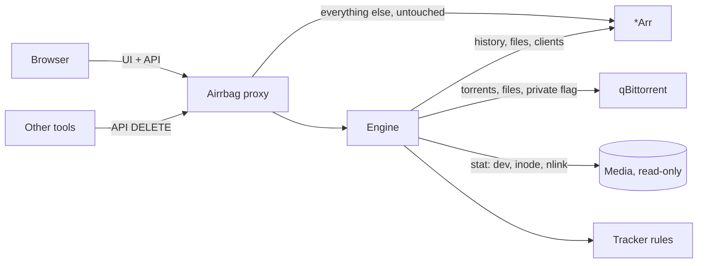
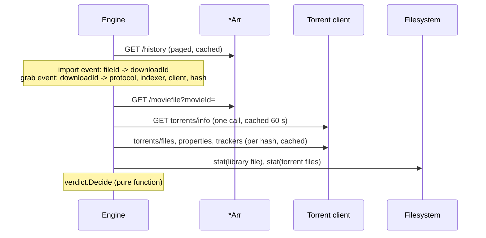

# Design

## Goal

Answer one question per library file, everywhere a user can delete it: what
happens to the bytes a tracker is still counting on?

## Architecture

One listener per *Arr instance. The proxy:

1. Adds one `<script>` tag to HTML responses (gzip is decoded; anything else
   passes untouched; API, static and websocket traffic is never modified).
2. Serves its own endpoints under `/__airrbag/`.
3. Evaluates DELETE requests that remove files and answers `409` for `keep`.

## Data flow for one file

## Decisions

**Reverse proxy, not a browser extension.** It works on every device and
browser with nothing to install, and the same process can enforce the rule
server-side. An extension can only warn the browser it runs in.

**Provenance from the API, not from the UI.** The badges' DOM layer is the
only fragile part. Everything that decides a verdict uses documented REST
endpoints, which change far less often than the web UI.

**Inode comparison.** History says a file came from a torrent; only the
filesystem says whether deleting it removes the torrent's data. A hardlink
(same device and inode, different name) survives deletion of the library name.

**Delete interception below the UI.** The script patches `XMLHttpRequest` and
`fetch` for `DELETE /api/vN/...` instead of hooking buttons, so it is
independent of how each app draws its delete dialogs. The *Arr UI's own request
cannot carry an extra header, so a confirmed dialog registers a one-shot grant
keyed by method, path, query and body hash; the guard consumes it.

**Evidence chain when the history is silent.** Many libraries hold files the
*Arr history never recorded: imported by hand, by another tool, or before the
history kept them. Airrbag then gathers evidence in order of strength and
stops at the first hit:

1. Inode: the same bytes as a file of any torrent in any client (one walk of
   every torrent's content, cached 15 minutes), or of a file in a
   direct-download folder.
2. Import folder: the import event's source path lies inside a torrent's
   content or a Usenet client's finished folder.
3. Release name, normalized (case, separators, media extension): a finished
   SABnzbd job, an NZBHydra2 grab (NZB or torrent, with the indexer), a file
   in a direct-download folder, a torrent's name.

Names are weaker than inodes, so short or generic names (under 12
characters, one word) never match.

**Unknown is not safe, and torrent evidence is never unknown.** "We don't
know where it came from" used to mean "allow". For a torrent download whose
seed cannot be seen (client down, files unreadable) that is exactly the
hit-and-run airrbag exists to prevent, so any torrent evidence turns an
unknown verdict into `keep`. What remains unknown has no evidence at all, and
`guard.unknown` decides:

- `confirm` (default) asks once in the UI with a warning and lets an API
  caller without a grant through, logged at WARN and counted in
  `airrbag_unknown_deletes_total`. Blocking these by default would interrupt
  every cleanup of an old library while protecting nothing the evidence chain
  could identify. A visible warning plus an audit trail is the balance.
- `block` refuses them everywhere without a grant, for maximum safety.
- `allow` keeps only the badge.

**Fail closed for private trackers.** If the torrent client cannot be asked and
the indexer is private, the verdict is `keep`. If several clients exist and one
is down, "not found" is never concluded from a partial view.

**No own authentication.** Airrbag replays the caller's *Arr credentials
against `/system/status`. Whoever may use the *Arr may use Airrbag; verdicts
are never revealed to anyone else, not even in a 409 body.

**No egress beyond the stack.** One allowlist, built from the configured *Arr
upstreams and the download clients they list, wraps every outbound transport,
redirects included. A source-scan test fails the build on code that would
bypass it (default client, package-level `http.Get`).

**Dashboard: Preact, bundled and embedded.** The dashboard needs sortable,
filterable, paged tables and a few stateful views; hand-written DOM code (what
the injected script uses, to stay tiny and dependency-free) would grow into an
ad-hoc framework, and server-rendered templates plus htmx would put view logic
in two languages. Preact gives components and hooks in about 4 KB, esbuild
bundles it with the TypeScript into one JS and one CSS file, and `go:embed`
ships them in the binary. No CDN, no runtime fetch of anything foreign; the
shell is served with a CSP of `default-src 'none'; script-src 'self';
style-src 'self'` plus what the app needs from its own origin. Filtering,
sorting and paging run server-side, so a 14,000-file Lidarr library costs one
small JSON page per view.

**One look for badges and dashboard.** The label styles live once in
`web/src/shared/labels.css`: the dashboard bundles it, the injected script
imports it as text into its shadow root. Colours follow the Servarr label
palette, so a badge in Radarr and a row on the dashboard read the same.

**Refusals the *Arr UI can show.** The 409 uses the Servarr error shape
(`message`, `description`), which every generic error renderer in the *Arr
frontends reads. Their delete handlers store a failed request and show
nothing, so the injected script also recognises its own refusal (the
`airrbag: true` marker) on `XMLHttpRequest` and `fetch` and opens the dialog,
with the override.

**Pure core.** `internal/verdict` takes plain values and returns a verdict
with reasons. It has no I/O and carries most of the test cases.

## Package map

| Package | Responsibility |
|---|---|
| `internal/config` | YAML, `${ENV}` expansion, validation, defaults |
| `internal/egress` | Host allowlist every outbound HTTP client goes through |
| `internal/arr` | Servarr client, per-app shapes, history index |
| `internal/clients` | Download-client interfaces; `qbittorrent`, `sabnzbd` |
| `internal/paths` | Path translation between container views |
| `internal/fsx` | Inode identity |
| `internal/trackers` | Private detection and seeding obligations |
| `internal/verdict` | The decision |
| `internal/engine` | Caches and orchestration per instance |
| `internal/proxy` | Reverse proxy, injection, guard, API, dashboard endpoints |
| `internal/hub` | What every instance of one process shares: instance list, guard log, redacted config |
| `internal/webassets` | Embedded bundles (`make web`) and icons (`make icons`) |
| `web/src` | Injected script (TypeScript, esbuild) |
| `web/src/dashboard` | Dashboard (Preact + TypeScript, esbuild) |
| `web/src/shared` | Labels, colours and formatting used by both |
| `assets` | Logo sources; `scripts/icons.sh` renders the PNG set |
