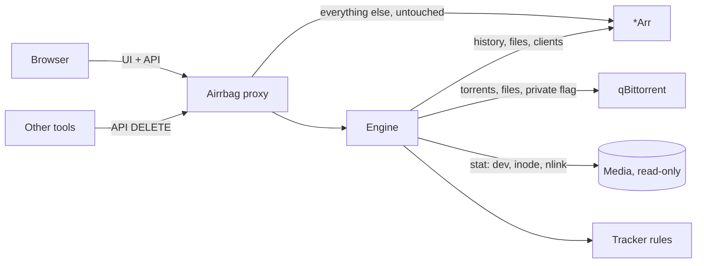

# Design

## Goal

Answer one question per library file, everywhere a user can delete it: what
happens to the bytes a tracker is still counting on?

## Architecture

One listener per *Arr instance. The proxy:

1. Adds one `<script>` tag to HTML responses (gzip is decoded; anything else
   passes untouched; API, static and websocket traffic is never modified).
2. Serves its own endpoints under `/__airrbag/`.
3. Evaluates DELETE requests that remove files and answers `409` for `keep`.

## Data flow for one file

## Decisions

**Reverse proxy, not a browser extension.** It works on every device and
browser with nothing to install, and the same process can enforce the rule
server-side. An extension can only warn the browser it runs in.

**Provenance from the API, not from the UI.** The badges' DOM layer is the
only fragile part. Everything that decides a verdict uses documented REST
endpoints, which change far less often than the web UI.

**Inode comparison.** History says a file came from a torrent; only the
filesystem says whether deleting it removes the torrent's data. A hardlink
(same device and inode, different name) survives deletion of the library name.

**Delete interception below the UI.** The script patches `XMLHttpRequest` and
`fetch` for `DELETE /api/vN/...` instead of hooking buttons, so it is
independent of how each app draws its delete dialogs. The *Arr UI's own request
cannot carry an extra header, so a confirmed dialog registers a one-shot grant
keyed by method, path, query and body hash; the guard consumes it.

**Fail closed for private trackers.** If the torrent client cannot be asked and
the indexer is private, the verdict is `keep`. If several clients exist and one
is down, "not found" is never concluded from a partial view.

**No own authentication.** Airrbag replays the caller's *Arr credentials
against `/system/status`. Whoever may use the *Arr may use Airrbag; verdicts
are never revealed to anyone else, not even in a 409 body.

**No egress beyond the stack.** One allowlist, built from the configured *Arr
upstreams and the download clients they list, wraps every outbound transport,
redirects included. A source-scan test fails the build on code that would
bypass it (default client, package-level `http.Get`).

**Pure core.** `internal/verdict` takes plain values and returns a verdict
with reasons. It has no I/O and carries most of the test cases.

## Package map

| Package | Responsibility |
|---|---|
| `internal/config` | YAML, `${ENV}` expansion, validation, defaults |
| `internal/egress` | Host allowlist every outbound HTTP client goes through |
| `internal/arr` | Servarr client, per-app shapes, history index |
| `internal/clients` | Download-client interfaces; `qbittorrent`, `sabnzbd` |
| `internal/paths` | Path translation between container views |
| `internal/fsx` | Inode identity |
| `internal/trackers` | Private detection and seeding obligations |
| `internal/verdict` | The decision |
| `internal/engine` | Caches and orchestration per instance |
| `internal/proxy` | Reverse proxy, injection, guard, API, lists page |
| `web/src` | Browser script (TypeScript, bundled by esbuild) |
